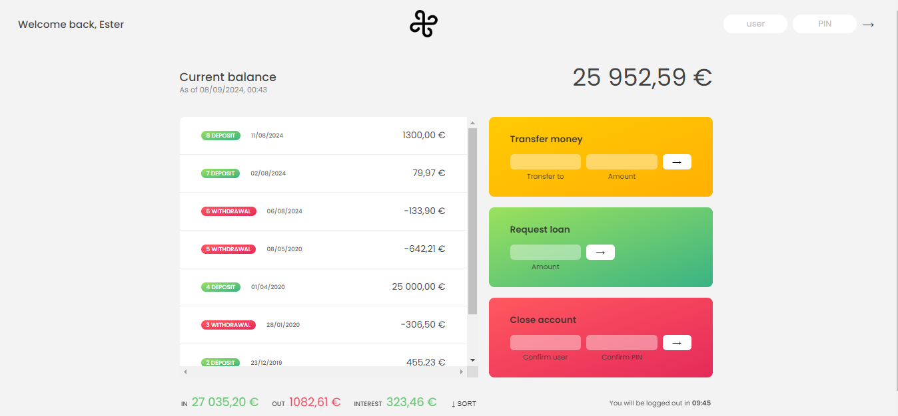

# Breeze App

A feature-rich, interactive banking app that allows users to manage their accounts, transfer money, request loans, and view account balances, transactions, and summaries. The app includes advanced features like currency conversion, a logout timer for security, and support for different locales and currencies.

<br />
<div align="center">
  <a href="https://breeze-ester.netlify.app/">
    
  </a>
  <h1 align="center">Breeze Bank & Investments</h1>

  <p align="center">
    <a href="https://breeze-ester.netlify.app/">View Demo</a>
  </p>
</div>

## Features

- **Account Login:** Log in with your unique username and PIN.
- **View Transactions:** Display past deposits and withdrawals along with formatted transaction dates.
- **Currency Conversion:** Automatically converts transferred amounts between different currencies.
- **Transfer Money:** Securely transfer funds to other users within the app.
- **Request Loans:** Apply for a loan, granted only if your account meets specific criteria.
- **Account Closure:** Delete an account by providing correct login credentials.
- **Automatic Logout:** Users are automatically logged out after 10 minutes of inactivity.
- **Responsive UI:** View account summaries such as total deposits, withdrawals, and interest earned.
- **Localization:** Date and currency formats are tailored to the user's locale.

## About The Project



## Tech Stack

- **JavaScript (ES6+):** Core logic of the application.
- **HTML5 & CSS3:** For structuring and styling the user interface.
- **Intl API:** To format numbers, currencies, and dates according to different locales.
- **DOM Manipulation:** For rendering account data dynamically.
- **GitHub:** Version control for the project.

### Flowchart


## How to Use

### Step 1: Clone the Repository

```bash
git clone https://github.com/yourusername/breeze-ester.git
```

### Step 2: Open the Project

Navigate to the project folder and open the index.html file in your browser.

### Step 3: Login with Test Accounts

Use one of the following test accounts to log in:

<ul>
<li>Username: em, PIN: 1111</li>
<li>Username: jd, PIN: 3333</li>
</ul>

### Step 4: Explore the Features

- View Movements: See the list of transactions with formatted dates and currency.
- Make Transfers: Transfer funds between accounts.
- Request Loans: Apply for a loan and receive it instantly (if you qualify).
- Close Account: Delete an account using the credentials

### Customization

You can customize the app by:

- Adding new accounts or changing existing ones in the script.js file.
- Updating currencies and exchange rates in the currency conversion object.
